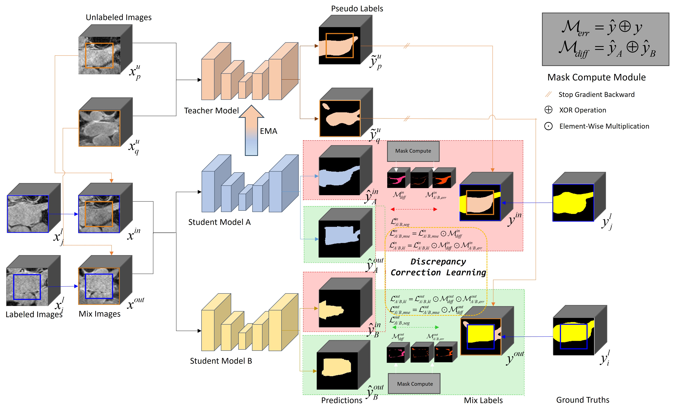

 # SDCL: Students Discrepancy-Informed Correction Learning for Semi-supervised Medical Image Segmentation

 #### By [Bentao Song](), [Qingfeng Wang]()
 


Pytorch implementation of our method for MICCAI 2024 paper: "SDCL: Students Discrepancy-Informed Correction Learning for Semi-supervised Medical Image Segmentation".[Paper Link](https://papers.miccai.org/miccai-2024/672-Paper0821.html)
## Contents
- [Abstract](##Abstract)
- [Introduction](##Introduction)
- [Requirements](##Requirements)
- [Datasets](##Datasets)
- [Usage](##Usage)
- [Acknowledgements](##Acknowledgements)

## Abstract


Semi-supervised medical image segmentation (SSMIS) has been demonstrated the potential to mitigate the issue of 
limited medical labeled data. However, confirmation and cognitive biases may affect the prevalent teacher-student based SSMIS methods due to erroneous pseudo-labels. 
To tackle this challenge, we improve the mean teacher approach and propose the Students Discrepancy-Informed Correction Learning 
(SDCL) framework that includes two students and one non-trainable teacher, which utilizes the segmentation difference between the two students to guide the self-correcting learning. 
The essence of SDCL is to identify the areas of segmentation discrepancy as the potential bias areas, and then encourage the model to review the correct cognition and rectify 
their own biases in these areas. To facilitate the bias correction learning with continuous review and rectification, two correction loss functions are employed to minimize the correct segmentation voxel distance and maximize the erroneous segmentation voxel entropy. We conducted experiments on three public medical image datasets: two 3D datasets (CT and MRI) and one 2D dataset (MRI). The results show that our SDCL surpasses 
the current State-of-the-Art (SOTA) methods by 2.57%, 3.04%, and 2.34% in the Dice score on the Pancreas, LA, and ACDC datasets, respectively. In addition, the accuracy of our method is very close to the fully supervised method on the ACDC dataset,  and even exceeds the fully supervised method on the Pancreas and LA dataset. 

## Introduction
Official code for "SDCL: Students Discrepancy-Informed Correction Learning for Semi-supervised Medical Image Segmentation".
Due to the large size of the model parameter files, it is difficult to upload them anonymously. After our paper is accepted, we will publish both the pretrained model and the fully trained model.

The proof for the kl_loss in the code can be found in the document "MICCAI2024_SDCL.pdf".

## Requirements
This repository is based on PyTorch 2.1.0, CUDA 12.1, and Python 3.8. All experiments in our paper were conducted on an NVIDIA GeForce RTX 4090 GPU with an identical experimental setting under Windows.
## Datasets
**Preprocess**: refer to the image pre-processing method in [CoraNet](https://github.com/koncle/CoraNet) and [BCP](https://github.com/DeepMed-Lab-ECNU/BCP) for the Pancreas dataset, Left atrium and ACDC dataset. 
The `dataloaders` folder contains the necessary code to preprocess the Left atrium and ACDC dataset. 
Pancreas pre-processing code can be got at [CoraNet](https://github.com/koncle/CoraNet).

**Dataset split**: The `./Datasets` folder contains the information about the train-test split for all three datasets.
## Usage
We provide `code`, `data_split` and `models` (Include pre-trained models and fully trained models) for Pancreas, LA and ACDC dataset.

Data could be got at [Pancreas](https://wiki.cancerimagingarchive.net/display/Public/Pancreas-CT), [LA](https://github.com/yulequan/UA-MT/tree/master/data) and [ACDC](https://github.com/HiLab-git/SSL4MIS/tree/master/data/ACDC).

To train a model,
```
python ./code/pancreas/Pancreas_train.py  #for Pancreas training
python ./code/LA_train.py  #for LA training
python ./code/ACDC_train.py  #for ACDC training
``` 

To test a model,
```
python ./code/pancreas/test_Pancreas.py  #for Pancreas testing
python ./code/test_LA.py  #for LA testing
python ./code/test_ACDC.py  #for ACDC testing
```
### Citation
If our SDCL is useful for your research, please consider citing:
        @inproceedings{song2024sdcl,
         title={SDCL: Students Discrepancy-Informed Correction Learning for Semi-supervised Medical Image Segmentation},
         author={Song, Bentao and Wang, Qingfeng},
         booktitle={International Conference on Medical Image Computing and Computer-Assisted Intervention},
         pages={567--577},
         year={2024},
         organization={Springer}
         }
## Acknowledgements
Our code is largely based on [BCP](https://github.com/DeepMed-Lab-ECNU/BCP). Thanks for these authors for their valuable work, hope our work can also contribute to related research.


